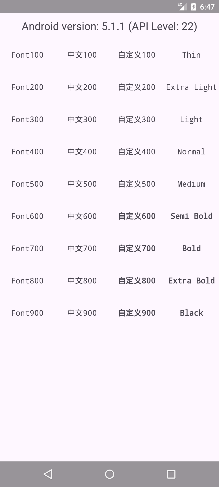
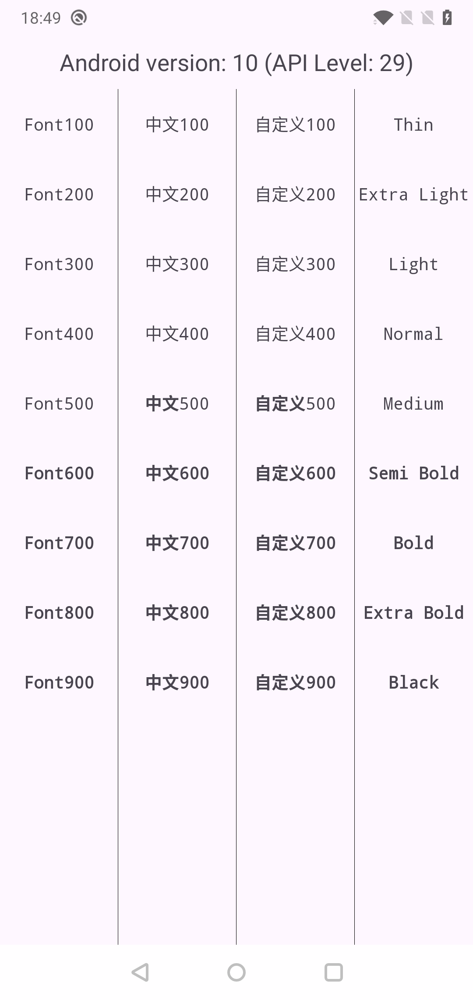
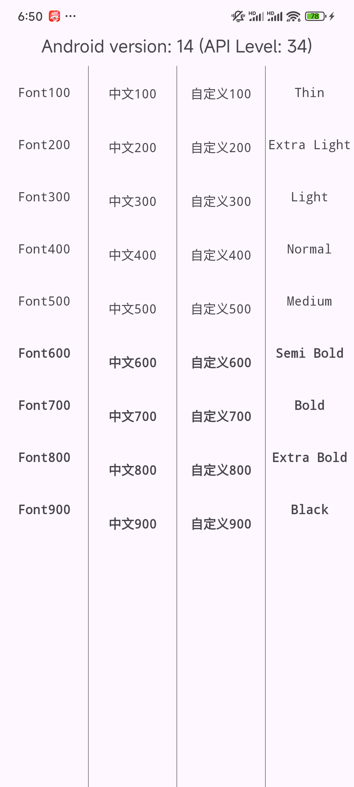

# FontWeightTextView

让`textFontWeight`属性支持Api29(Android9-p)以下。

| 模拟器 Android5.1            | OnePlus6 Android10           | RedmiK50 Android14           |
| ---------------------------- | ---------------------------- | ---------------------------- |
|  |  |  |

## 导入依赖

```kotlin
maven { url 'https://jitpack.io' }
```

```kotlin
//compileSdk=34(appcompat:1.7.0) - 导入依赖
implementation("com.github.simplepeng:FontWeightTextView:1.0.0") 
// 或 compileSdk=34(appcompat:1.6.1) - 导入依赖
implementation("com.github.simplepeng:FontWeightTextView:compat_161")
```

## 添加FontWeightTextView

```xml
<me.simple.fwtv.FontWeightTextView
    style="@style/WeightTextStyle"
    android:layout_width="wrap_content"
    android:layout_height="wrap_content"
    android:text="自定义400"
    app:textFontWeight="400" />
```

`textFontWeight`属性支持`1-1000`的数值。

## 或FontWeightValueTextView

```xml
<me.simple.fwtv.FontWeightValueTextView
    style="@style/WeightTextStyle"
    android:layout_width="wrap_content"
    android:layout_height="wrap_content"
    android:text="Medium"
    app:fontWeightValue="medium" />
```

`fontWeightValue`支持以下属性：

```xml
<declare-styleable name="FontWeightValueTextView">
    <attr name="fontWeightValue" format="enum">
        <enum name="thin" value="100" />"
        <enum name="extraLight" value="200" />"
        <enum name="light" value="300" />"
        <enum name="normal" value="400" />"
        <enum name="medium" value="500" />"
        <enum name="semiBold" value="600" />"
        <enum name="bold" value="700" />"
        <enum name="extraBold" value="800" />"
        <enum name="black" value="900" />"
    </attr>
</declare-styleable>
```

## 感谢各位大佬打赏🙇🙇🙇！

您的支持是作者努力更新的动力。万水千山总是情，10.24我看行！

|  |  |  |
| ------------------------------------------------------------ | ----- | ----- |

[打赏链接](https://simplepeng.com/merge_pay_code/) | [赞助列表](https://simplepeng.com/Sponsor/)

## 版本发布

* v1.0.0 - 首次发布